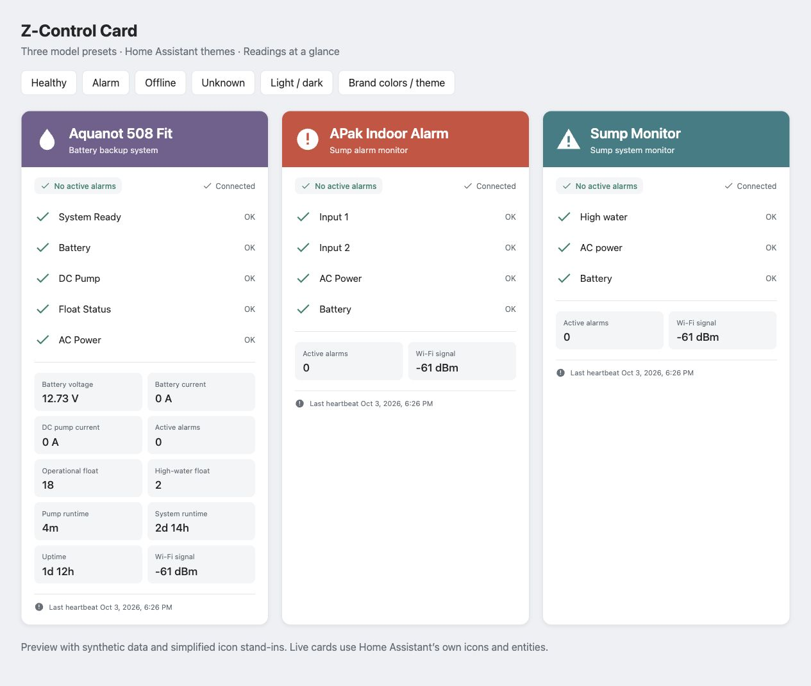
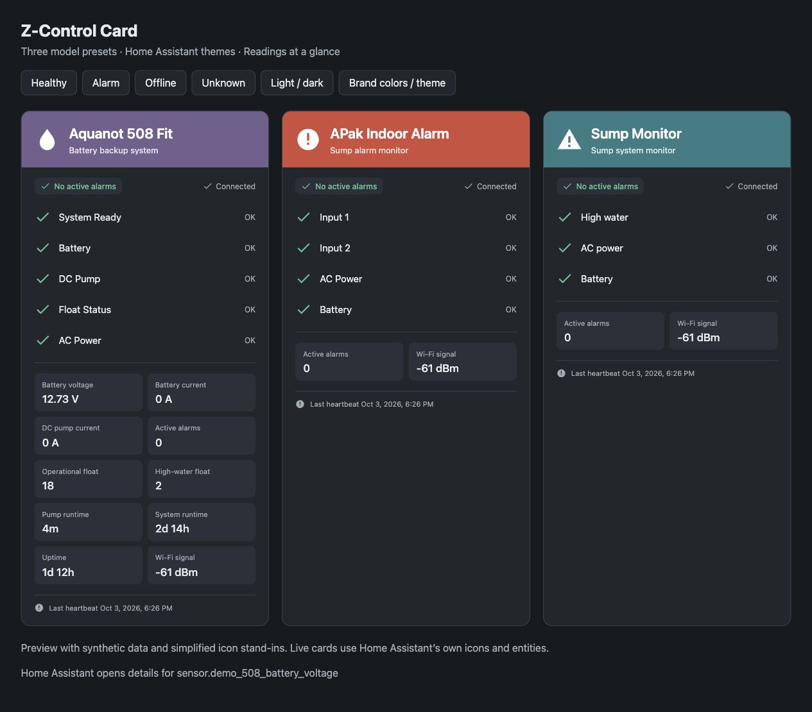

# Z-Control Card

Home Assistant dashboard cards for **Aquanot 508 Fit**, **APak**, and generic sump controllers. Inspired by the Z-Control Cloud status layout, with readings directly inside the card.

**Integration and credit:** These cards are designed to accompany [levineds/zcontrol-ha](https://github.com/levineds/zcontrol-ha), the public Z-Control integration for Home Assistant. Thanks to [levineds](https://github.com/levineds) for creating and maintaining the integration that makes these entities available. Install that integration separately; this repository provides the dashboard card, not the cloud connection.





## Features

- Purple 508, red APak, and teal generic headers with Home Assistant icons.
- Home Assistant theme typography, backgrounds, borders, and success/error colors; optional theme-only headers.
- Inline battery voltage/current, pump current, float counts, runtimes, alarm count, and Wi-Fi readings when those entities exist.
- Unknown, unavailable, offline, and delayed-data states. Last reported healthy states stop showing green checks when monitoring is offline or stale.
- Standard Home Assistant more-info when you select a status or reading. No View button or pump commands.
- Basic visual editor, plus YAML for custom entity mappings and layouts.

One JavaScript module, no runtime dependencies, telemetry, or extra cloud requests. Optional HTTPS logo URLs request an image from that host; local `/local/` images keep branding local.

## Install

The first version is a **prerelease for testing**. Implementation changes are reviewed through a pull request; a release asset lets you test before merging.

### HACS

1. Open HACS **Custom repositories** and add `https://github.com/lyonsad/zcontrol-card` with type **Dashboard** (older versions call this **Lovelace**).
2. Find **Z-Control Card** and download it. If necessary, enable prerelease/beta versions in the version picker and choose `v0.1.0-beta.1`.
3. Confirm the dashboard resource exists as a JavaScript module: `/hacsfiles/zcontrol-card/zcontrol-card.js`.
4. Reload the browser, edit a dashboard, and add **Z-Control Card**, or paste an example into a manual card.

See [HACS custom repositories](https://hacs.xyz/docs/faq/custom_repositories/) and [Home Assistant resources](https://developers.home-assistant.io/docs/frontend/custom-ui/registering-resources/). This repository is not yet in the HACS default store.

### Manual

Download `zcontrol-card.js` from the [releases page](https://github.com/lyonsad/zcontrol-card/releases), copy it to `config/www/zcontrol-card.js`, and add `/local/zcontrol-card.js` as a **JavaScript module** resource. If you create the `www` folder for the first time, restart Home Assistant once so it can serve that directory. Reload your browser. Use a version query string when updating if the old file remains cached.

## Quick start

Replace the prefix with your actual entity prefix. This is a naming convenience, not device discovery. Check entity IDs in Home Assistant; overrides support renamed entities.

```yaml
type: custom:zcontrol-card
model: '508'
entity_prefix: sump_pump
```

```yaml
type: custom:zcontrol-card
model: apak
entity_prefix: sump_alarm
```

The 508 preset uses **System Ready, Battery, DC Pump, Float Status, and AC Power**. It excludes Input 1/Input 2: generic inputs are not substitutes for the 508 float/system alarm mappings. APak shows **Input 1, Input 2, AC Power, and Battery**. Labels do not identify physical wiring; name each input according to its connected sensor.

508 readings require an integration version exposing the corrected mappings and telemetry. Check [upstream 508 support](https://github.com/levineds/zcontrol-ha/pull/1) for current status. The card cannot recover readings the integration does not expose.

## Match your dashboard

```yaml
type: custom:zcontrol-card
model: '508'
entity_prefix: sump_pump
title: Basement sump
brand_colors: false
metric_columns: 2
```

Default branding uses model names, HA icons, and header accents. For a logo, place an image you are entitled to use in `config/www/`, then set `logo: /local/your-logo.png`. Failed images fall back to the model icon. Vendor artwork is not bundled. This independent community project is not an official Zoeller product; Zoeller, Aquanot, APak, and Z-Control names belong to their respective owners.

## Entity overrides and selected readings

Explicit `metrics` replace automatic readings, controlling order and card height. Missing explicitly selected entities display **Unknown**. Set an entity field to `false` to disable a preset binding. Explicit `statuses` replace all preset rows.

```yaml
type: custom:zcontrol-card
model: apak
entity_prefix: sump_alarm
entities:
  input_1: binary_sensor.sump_alarm_float_switch
  input_2: false
metrics:
  - entity: sensor.sump_alarm_alarm_count
    name: Active alarms
  - entity: sensor.sump_alarm_wifi_signal
    name: Wi-Fi signal
```

## Generic controllers

Use explicit statuses for a model without a preset. The card does not infer wiring, capabilities, or polarity. By default **on means alarm** and **off means OK**, matching integration problem sensors. For an entity where on means healthy, set `invert: true`.

```yaml
type: custom:zcontrol-card
model: generic
title: Sump system
entities:
  online: binary_sensor.sump_online
  alarm_count: sensor.sump_alarm_count
  last_heartbeat: sensor.sump_last_heartbeat
statuses:
  - entity: binary_sensor.sump_high_water
    name: High water
  - entity: binary_sensor.sump_ready
    name: System Ready
    invert: true
metrics:
  - entity: sensor.sump_battery_voltage
    name: Battery voltage
```

## Options

| Option | Default | Purpose |
| --- | --- | --- |
| `model` | `generic` | `508`, `apak`, or `generic`; selects labels and accent. |
| `entity_prefix` | none | Builds conventional IDs listed below. |
| `entities` | none | Override field IDs; `false` disables a binding. |
| `title`, `subtitle` | model defaults | Header text. |
| `brand_colors` | `true` | False uses a theme-colored icon and normal HA background. |
| `accent_color` | model color | Six-digit hex accent, such as `'#71608e'`. |
| `logo` | none | Local `/path` or HTTPS image. |
| `statuses` | model preset | Replace rows with `{entity, name?, invert?}` entries. |
| `metrics` | existing mapped readings | Replace tiles with `{entity, name?}` entries. |
| `metric_columns` | `2` | One, two, or three reading columns. |
| `show_metrics` | `true` | Hide reading tiles. |
| `show_heartbeat` | `true` | Hide footer; freshness checks still run. |
| `stale_after` | `10` | Minutes after heartbeat to mark data delayed; `0` disables. |

For prefix `sump_pump`, `battery` maps to `binary_sensor.sump_pump_battery`. Fields and suffixes:

| Domain | Fields / suffixes |
| --- | --- |
| `binary_sensor` | `online`, `battery`, `ac_power`, `input_1`, `input_2` |
| `binary_sensor` | `system_ready` → `system_ready_alarm`; `dc_pump` → `dc_pump_alarm`; `float_status` → `float_status_alarm` |
| `sensor` | `alarm_count`, `battery_voltage`, `battery_current`, `dc_pump_current`, `operational_float_count`, `high_water_float_count`, `pump_runtime`, `system_run_time`, `up_time`, `wifi_signal`, `last_heartbeat` |

Automatic metrics include existing mapped entities only; existing unavailable entities still appear. Durations with HA device class `duration` and units `ms`, `s`, `min`, `h`, or `d` become days/hours/minutes (seconds below one minute). The entity’s actual unit is used, including user-selected days. Other readings use HA display formatting when available.

## Status and freshness

Any displayed alarm or positive mapped `alarm_count` produces an alarm summary, even if that particular alarm has no row. Offline or stale alarms say **Last reported alarm**. Unknown readings never imply healthy status. Connectivity is separate: `online: on` means connected. Invalid/missing heartbeats are labeled unknown; freshness cannot be determined without a timestamp. Tune the threshold to the controller’s heartbeat interval.

This monitoring display does not replace physical alarms or notifications. It invokes no controller commands, tests, resets, silence actions, or services.

## Development and validation

Node 20+ for development; no package installation or build step:

```sh
node --check zcontrol-card.js
node --test
python3 -m http.server 8766 --bind 127.0.0.1
```

Open `http://127.0.0.1:8766/demo/` for synthetic healthy/alarm/offline/unknown data and theme/branding controls. Demo icons are simplified stand-ins; live cards use `ha-icon`. Tests cover the three presets, polarity/inversion, overrides, unknown states, catch-all alarms, freshness, durations, formatting, and configuration validation. GitHub CI repeats syntax and unit checks.

Initial browser validation uses simulated entities. The generic preset has no physical-controller validation yet. The real HA card picker, visual editor, and installed integration still need beta testing. The declared minimum is HA 2024.11; that minimum has not been tested live.

## Credits and license

- [levineds/zcontrol-ha](https://github.com/levineds/zcontrol-ha), by [levineds](https://github.com/levineds): the integration providing Z-Control entities.
- [Home Assistant](https://www.home-assistant.io/) and its [custom-card interface](https://developers.home-assistant.io/docs/frontend/custom-ui/custom-card/).
- Zoeller’s Z-Control Cloud inspired the status layout and model color accents.

Card source is [MIT licensed](LICENSE). Integration source and vendor logo files are not redistributed here.
