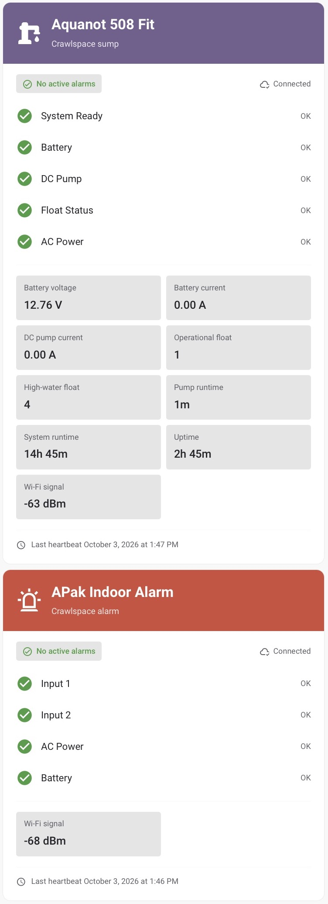

# Z-Control Card

Home Assistant dashboard cards for **Aquanot 508 Fit**, **APak**, and generic sump controllers. Inspired by the Z-Control Cloud status layout, with readings directly inside the card.

**Integration and credit:** These cards are designed to accompany [levineds/zcontrol-ha](https://github.com/levineds/zcontrol-ha), the public Z-Control integration for Home Assistant. Thanks to [levineds](https://github.com/levineds) for creating and maintaining the integration that makes these entities available. Install that integration separately; this repository provides the dashboard card, not the cloud connection.

## Live screenshots

These are actual Home Assistant cards connected to a Zoeller 508 and APak. Captured from the installed **v0.1.0** card on October 3, 2026; the image is cropped to the cards only, with no alteration to their content. The development demo uses synthetic data and is kept separately under `demo/`.



## Tested compatibility

| Component | Verified version / coverage |
| --- | --- |
| Home Assistant Core | **2026.9.4** |
| Home Assistant frontend | **20260826.7**, Safari on macOS |
| Installation | Home Assistant OS; HACS custom Dashboard repository |
| Controllers | Aquanot 508 Fit and APak, live monitoring entities |
| Integration | Z-Control integration test build `1.1.0-test.4` with corrected 508 mappings |

Verified live: HACS installation, card picker, YAML configuration, both model presets, normal status, telemetry updates, heartbeat display, duration units, and entity more-info. Alarm/offline/stale/unknown behavior has automated and simulated browser coverage; physical alarm events were not deliberately triggered. Generic controllers have simulated coverage only. **HA 2024.11 is the declared minimum, not a live-tested version.**

## Features

- Purple 508, red APak, and teal generic headers with Home Assistant icons.
- Home Assistant theme typography, backgrounds, borders, and success/error colors; optional theme-only headers.
- Inline battery voltage/current, pump current, float counts, runtimes, and Wi-Fi readings when those entities exist. Alarm count is optional; it always contributes to the summary when mapped.
- Unknown, unavailable, offline, and delayed-data states. Last reported healthy states stop showing green checks when monitoring is offline or stale.
- Standard Home Assistant more-info when you select a status or reading. No View button or pump commands.
- Basic visual editor, plus YAML for custom entity mappings and layouts.

One JavaScript module, no runtime dependencies, telemetry, or extra cloud requests. Optional HTTPS logo URLs request an image from that host; local `/local/` images keep branding local.

## Before you install

Install and configure [levineds/zcontrol-ha](https://github.com/levineds/zcontrol-ha) first. Confirm its device entities have readings in Home Assistant. This card reads those entities; it does not ask for Z-Control credentials or connect to the portal.

The 508 preset needs the corrected 508 status mappings and telemetry from a compatible integration version. See [upstream 508 support](https://github.com/levineds/zcontrol-ha/pull/1) for its current availability. Older integration versions may show missing or unknown readings; installing the card does not fix integration mappings.

## Install with HACS (recommended)

1. Open **HACS**, select the **three-dot menu → Custom repositories**.
2. Enter `https://github.com/lyonsad/zcontrol-card`, choose **Dashboard** (called **Lovelace** in older HACS versions), and select **Add**.
3. Search HACS for **Z-Control Card**, open it, and select **Download**. Choose the latest numbered release. No beta setting is required for `v0.1.0`.
4. Accept **Reload** when HACS asks to reload your browser.
5. Open **Settings → Dashboards → three-dot menu → Resources**. Confirm `/hacsfiles/zcontrol-card/zcontrol-card.js` is registered as **JavaScript module**. Enable **Advanced mode** in your HA profile if Resources is hidden. If HACS did not add it, add that URL yourself with type JavaScript module.
6. Add and configure a card using the instructions below.

The implementation is on **`main`**. HACS normally installs a numbered release for repeatable updates; its card asset matches the published code on `main`. To test the current branch directly, use **Need a different version? → main** in HACS. `main` is available, but can include changes newer than a numbered release. This is a custom repository, not a HACS default-store listing.

## Install manually from main

1. Download [zcontrol-card.js from main](https://raw.githubusercontent.com/lyonsad/zcontrol-card/main/zcontrol-card.js) and save it as `config/www/zcontrol-card.js` (not an HTML GitHub page).
2. If you created `www` for the first time, restart Home Assistant once so it can serve the folder. Otherwise a browser refresh is enough.
3. Under **Settings → Dashboards → three-dot menu → Resources**, add `/local/zcontrol-card.js` with type **JavaScript module**. Advanced mode may be needed to see Resources.
4. Reload the browser, then add a card. For a fixed version, download the same file from [releases](https://github.com/lyonsad/zcontrol-card/releases/latest).

## Add and configure a card

1. Open your dashboard and select **Edit dashboard → Add card → By card**.
2. Choose **Z-Control Card**. In its visual editor, choose the model and enter the entity prefix. Titles, subtitle, logo path, reading columns, and brand colors are optional.
3. Select **Save**, then **Done**. For explicit entity mappings or custom rows, use **Show code editor**. Alternatively choose **Manual** in the card picker and paste an example below.

### Find your entity prefix

Open **Settings → Devices & services → Entities**, find one of the integration’s entities, and inspect its entity ID (also available in the entity’s settings dialog).

For `binary_sensor.basement_sump_battery`, remove the domain `binary_sensor.` and suffix `_battery`: the prefix is **`basement_sump`**. Enter that exact prefix, without a domain. Confirm other entities follow the same naming pattern. The prefix does not discover devices; renamed or differently named entities need `entities` overrides below.

### Aquanot 508 Fit

```yaml
type: custom:zcontrol-card
model: '508'
entity_prefix: basement_sump
```

### APak

```yaml
type: custom:zcontrol-card
model: apak
entity_prefix: basement_alarm
```

Use [examples/cards.yaml](examples/cards.yaml) to add two devices as one group, replacing its sample prefixes with your own.

The 508 preset uses **System Ready, Battery, DC Pump, Float Status, and AC Power**. It excludes Input 1/Input 2: generic inputs are not substitutes for the 508 float/system alarm mappings. APak shows **Input 1, Input 2, AC Power, and Battery**. Labels do not identify physical wiring; name each input according to its connected sensor.

508 readings require an integration version exposing the corrected mappings and telemetry. Check [upstream 508 support](https://github.com/levineds/zcontrol-ha/pull/1) for current status. The card cannot recover readings the integration does not expose.

## Match your dashboard

```yaml
type: custom:zcontrol-card
model: '508'
entity_prefix: sump_pump
title: Basement sump
brand_colors: false
metric_columns: 2
```

Default branding uses model names, HA icons, and header accents. For a logo, place an image you are entitled to use in `config/www/`, then set `logo: /local/your-logo.png`. Failed images fall back to the model icon. Vendor artwork is not bundled. This independent community project is not an official Zoeller product; Zoeller, Aquanot, APak, and Z-Control names belong to their respective owners.

## Entity overrides and selected readings

The default readings omit alarm count because the status summary already communicates alarms. The mapped count still contributes to that summary. Add it explicitly to `metrics` if you want a numeric tile. Explicit `metrics` replace automatic readings, controlling order and card height. Missing explicitly selected entities display **Unknown**. Set an entity field to `false` to disable a preset binding. Explicit `statuses` replace all preset rows.

```yaml
type: custom:zcontrol-card
model: apak
entity_prefix: sump_alarm
entities:
  input_1: binary_sensor.sump_alarm_float_switch
  input_2: false
metrics:
  - entity: sensor.sump_alarm_alarm_count
    name: Active alarms
  - entity: sensor.sump_alarm_wifi_signal
    name: Wi-Fi signal
```

## Generic controllers

Use explicit statuses for a model without a preset. The card does not infer wiring, capabilities, or polarity. By default **on means alarm** and **off means OK**, matching integration problem sensors. For an entity where on means healthy, set `invert: true`.

```yaml
type: custom:zcontrol-card
model: generic
title: Sump system
entities:
  online: binary_sensor.sump_online
  alarm_count: sensor.sump_alarm_count
  last_heartbeat: sensor.sump_last_heartbeat
statuses:
  - entity: binary_sensor.sump_high_water
    name: High water
  - entity: binary_sensor.sump_ready
    name: System Ready
    invert: true
metrics:
  - entity: sensor.sump_battery_voltage
    name: Battery voltage
```

## Options

| Option | Default | Purpose |
| --- | --- | --- |
| `model` | `generic` | `508`, `apak`, or `generic`; selects labels and accent. |
| `entity_prefix` | none | Builds conventional IDs listed below. |
| `entities` | none | Override field IDs; `false` disables a binding. |
| `title`, `subtitle` | model defaults | Header text. |
| `brand_colors` | `true` | False uses a theme-colored icon and normal HA background. |
| `accent_color` | model color | Six-digit hex accent, such as `'#71608e'`. |
| `logo` | none | Local `/path` or HTTPS image. |
| `statuses` | model preset | Replace rows with `{entity, name?, invert?}` entries. |
| `metrics` | existing mapped readings | Replace tiles with `{entity, name?}` entries. |
| `metric_columns` | `2` | One, two, or three reading columns. |
| `show_metrics` | `true` | Hide reading tiles. |
| `show_heartbeat` | `true` | Hide footer; freshness checks still run. |
| `stale_after` | `10` | Minutes after heartbeat to mark data delayed; `0` disables. |

For prefix `sump_pump`, `battery` maps to `binary_sensor.sump_pump_battery`. Fields and suffixes:

| Domain | Fields / suffixes |
| --- | --- |
| `binary_sensor` | `online`, `battery`, `ac_power`, `input_1`, `input_2` |
| `binary_sensor` | `system_ready` → `system_ready_alarm`; `dc_pump` → `dc_pump_alarm`; `float_status` → `float_status_alarm` |
| `sensor` | `alarm_count`, `battery_voltage`, `battery_current`, `dc_pump_current`, `operational_float_count`, `high_water_float_count`, `pump_runtime`, `system_run_time`, `up_time`, `wifi_signal`, `last_heartbeat` |

Automatic metrics include existing mapped entities only; existing unavailable entities still appear. Durations with HA device class `duration` and units `ms`, `s`, `min`, `h`, or `d` become days/hours/minutes (seconds below one minute). The entity’s actual unit is used, including user-selected days. Other readings use HA display formatting when available.

## Status and freshness

Any displayed alarm or positive mapped `alarm_count` produces an alarm summary, even if that particular alarm has no row. Offline or stale alarms say **Last reported alarm**. Unknown readings never imply healthy status. Connectivity is separate: `online: on` means connected. Invalid/missing heartbeats are labeled unknown; freshness cannot be determined without a timestamp. Tune the threshold to the controller’s heartbeat interval.

This monitoring display does not replace physical alarms or notifications. It invokes no controller commands, tests, resets, silence actions, or services.

## Development and validation

Node 20+ for development; no package installation or build step:

```sh
node --check zcontrol-card.js
node --test
python3 -m http.server 8766 --bind 127.0.0.1
```

Open `http://127.0.0.1:8766/demo/` for synthetic healthy/alarm/offline/unknown data and theme/branding controls. Demo icons are simplified stand-ins; live cards use `ha-icon`. Tests cover the three presets, polarity/inversion, overrides, unknown states, catch-all alarms, freshness, durations, formatting, and configuration validation. GitHub CI repeats syntax and unit checks.

The live-tested versions and controller coverage are listed above. The standalone demo remains useful for simulated alarms and generic configurations. CI runs the same syntax and unit checks.

## Troubleshooting and updates

- **Custom element doesn’t exist:** confirm the JavaScript module resource URL, then reload the browser. After an update, force-refresh or clear that site’s frontend cache if the old file remains loaded. Do not install both the manual and HACS resource simultaneously.
- **Not available / Unknown:** check the exact entity ID and the integration’s state in HA. Override renamed entities. Unsupported controller readings cannot be supplied by the card.
- **Data delayed:** check connectivity and heartbeat, then adjust `stale_after` to the controller’s expected reporting interval if necessary. `0` disables this freshness check.
- **Duplicate alarm tile:** the default layout omits it. Remove an `alarm_count` entry from your explicit `metrics` list if you also want it hidden there.
- **Updating:** use HACS to download a new release and reload your browser. Manual users replace the JavaScript file and refresh; a resource query string such as `?v=0.1.0` can help with caching.
- **Removing:** delete the dashboard card, remove its resource, and uninstall Z-Control Card through HACS (or delete the manually installed file). This does not uninstall the separate Z-Control integration.

See [HACS custom repositories](https://hacs.xyz/docs/faq/custom_repositories/) and [HA resource registration](https://developers.home-assistant.io/docs/frontend/custom-ui/registering-resources/) for the platform instructions.

## Credits and license

- [levineds/zcontrol-ha](https://github.com/levineds/zcontrol-ha), by [levineds](https://github.com/levineds): the integration providing Z-Control entities.
- [Home Assistant](https://www.home-assistant.io/) and its [custom-card interface](https://developers.home-assistant.io/docs/frontend/custom-ui/custom-card/).
- Zoeller’s Z-Control Cloud inspired the status layout and model color accents.

Card source is [MIT licensed](LICENSE). Integration source and vendor logo files are not redistributed here.
